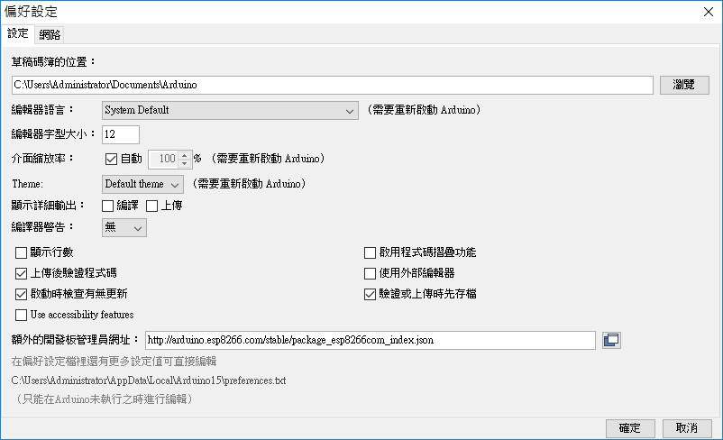
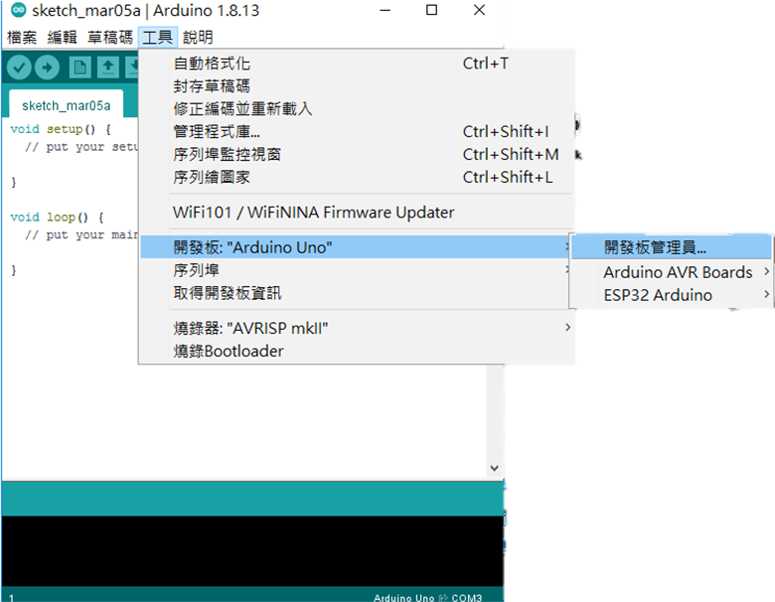
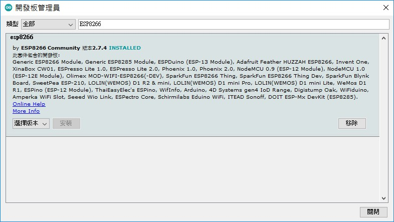
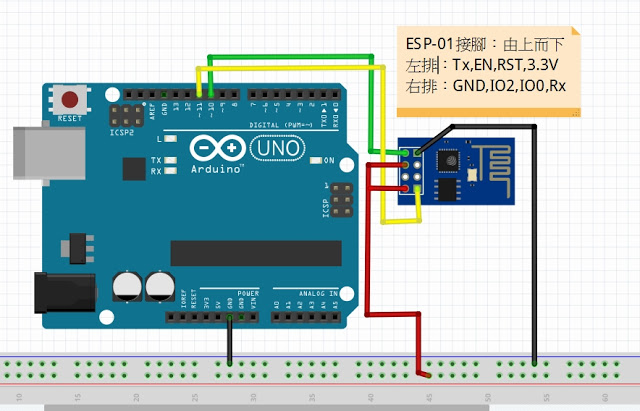

# arduino-uno-send-data-to-java-sockets

It’s easy to start ESP8266 programming, all what we’ve to do is adding it to the Arduino IDE software.
First, open Arduino IDE and go to File —> Preferences
Add the link below to Additional Boards Manager URLs and click on OK:
http://arduino.esp8266.com/stable/package_esp8266com_index.json

Now go to Tools —> Board —> Boards Manager

In the search box write esp8266 and click on Install and the installation of the board should start :

### arduino uno with esp8266, circuit connections are shown below ###
esp8266 pin EN,3.3v must connect to uno board 3.3v

